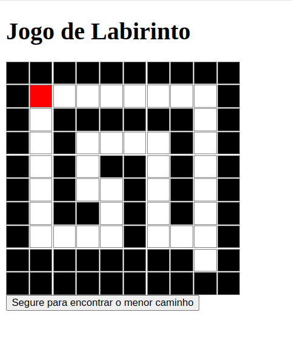
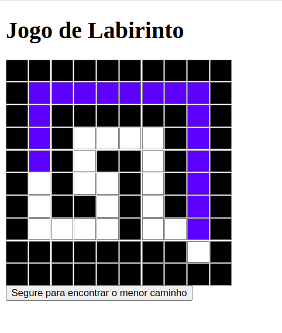

# Labirinto

**Número da Lista**: 20

**Conteúdo da Disciplina**: Grafos 2

## Alunos
|Matrícula | Aluno |
| -- | -- |
| 190028122  |  Gabriel Sabanai Trindade |
| 211029586  |  Sabrina Caldas Berno |

## Sobre 
O projeto consiste em um jogo de labirinto implementado utilizando React, onde o jogador navega por labirintos até alcançar um ponto de vitória. O jogo possui quatro fases, a qual o usuário só irá avançar caso chege no ponto final do labirinto, proporcionando uma experiência de jogo única a cada nova partida. Um dos nossos objetivos é utilizar o algoritmo de Dijkstra para encontrar o caminho mais curto até o ponto final no labirinto.

#### Funcionamento do Projeto:


- **Controles de Movimento:**

O jogador pode mover-se pelo labirinto usando as teclas de seta para explorar os caminhos disponíveis. Movimentos são validados para garantir que o jogador não passe através de paredes ou obstáculos.

- **Identificação do Caminho Mais Curto:**

Utiliza o algoritmo de Dijkstra implementado na função findShortestPath para encontrar o caminho mais curto do ponto que o usuário se encontra até o ponto final no labirinto. Este caminho é visualmente destacado para orientar o jogador.

- **Condição de Vitória:**

Quando o jogador alcança o ponto de vitória marcado no labirinto (geralmente no extremo oposto ao ponto de partida), uma mensagem de parabéns é exibida utilizando um alerta no navegador, indicando que o jogador completou o labirinto com sucesso e está apto para seguir para a próxima fase.

- **Fases do Jogo:**

O jogo possui quatro fases, a qual o usuário precisa ter concluído a anterior para avançar para a próxima. Ao concluir, o usuário verá na tela uma mensagem de sucesso e será redirecionado automaticamante para o próximo nível até chegar no quarto e último nível. 


## Screenshots




## Instalação 
**Linguagem**:  JavaScript
**Framework**:  React

É necessário ter o Node.js instalado para poder executar o projeto localmente.

## Uso 
Para executar o projeto, siga esse passo a passo:

```
cd maze
```
```
npm install
```
```
npm start 
```
## Vídeo sobre o Projeto 

[**Link do video de apresentação:** https://youtu.be/elGE93Kywk8](https://youtu.be/wG5irfyVXWk)
